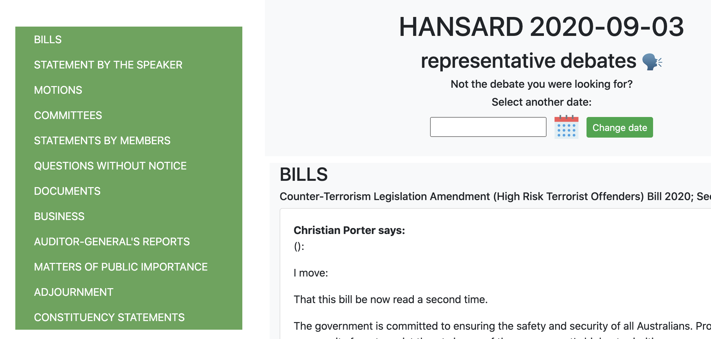
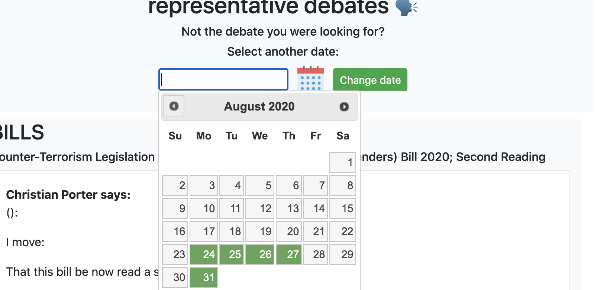
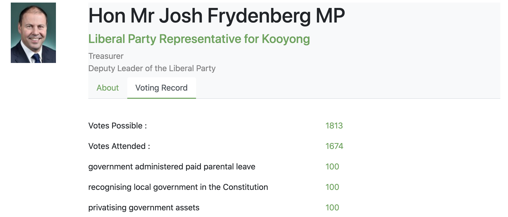
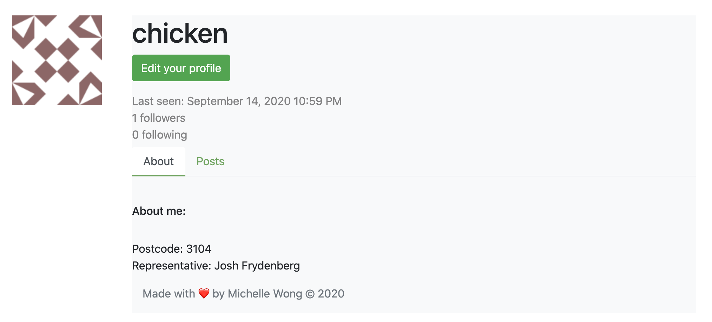
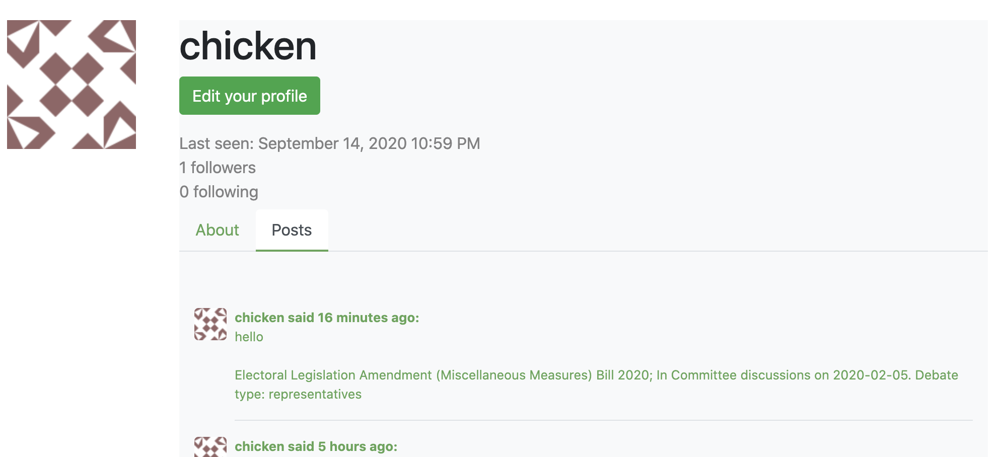
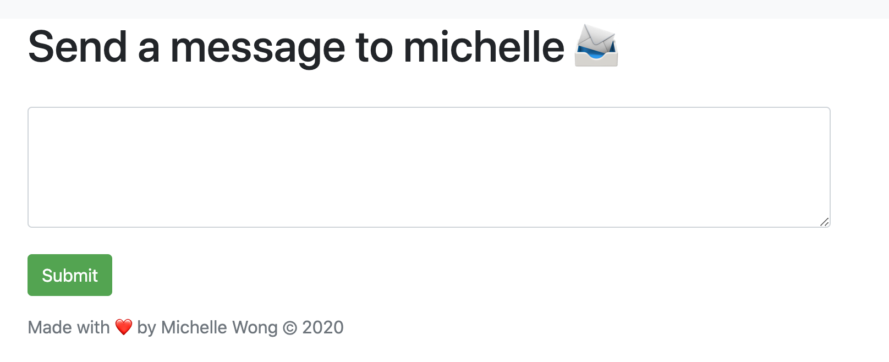
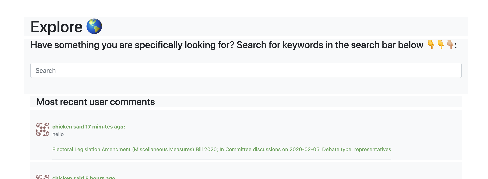

# Speakup - a new way to read parlormetry debates

## Find the project up and running at http://speakupp.azurewebsites.net/
## Description of project

Speakup is a social platform which allows the Australian community to digitally engage in parliamentary debates. Speakup allows its users to read and track Australian Senate and representative debates. Through our comment, following, and private messaging functions, the site also gives everyone the ability to share their thoughts on the debates with each other. It also helps the user connect with others with similar or contrary views on debate topics. In the simplest form, it serves as a “Facebook” website to invoke public awareness on parliamentary debates and promotes public engagement on Australians latest parliamentary discussions. The central goal of the project is to promote the idea that parliamentary debates aren't just for politicians, but for anyone who wants to be involved.

## Motivations surrounding the project

I became interested in building this project after I received an email from a advocacy group to mail my MP. After reading the email and I realised I had no idea how our parliament worked and didn’t understand where and how parliamentary decisions were made in Australia. It was then that I learned these decisions were made during parliamentary debates but only snippets of these discussions are shared in the news. That was when I found openaustralia, a website which worked similar to speak up and decided to set up something with similar format but with a more modern format and more social network functions.   

## Speakup - a digital tour

To give you are better understanding of the project, I will give you a brief tour of the website and the technologies involved .

### The development stack.
* HTML, CSS
* Javascript
* Bootstrap
* Flask
* A local SQLite and Azure SQL. I used both databases in the project because I found some of the data had major performance problems when migrated to Azure SQL. Some of the data shown on the website had also been taken from two scraped csv files.

### Other Technologies involved.

#### Flask extensions
The particular flask extensions were used in this project
* Flask-Login to handle user authentication.
* Flask- SQLAlchemy to handle database migrations
* Flask-WTF to handle webforms
* Flask-email for email support – particularly for logging errors and sending reset password emails.
* Flask-moment – to manage and convert date and time for users according to their browser settings.
* Flask-babel – for locale identification for translation services.

#### Other third party plugins used for the project
* Microsoft cognitive services – for comment translation
* Elasticsearch – for full-text search of blog posts and hansard debates.
* jQuery pagination plugin v1.4.2 at  http://josecebe.github.io/twbs-pagination/ - for pagination requirements in this project.


#### Public APIs used for the project

*	[Gravatar](https://en.gravatar.com/) to generate user avatars based on their email account, usually this is a random  geometric pattern unless the user is registered with a user account.
* Open Australia – I used both their python binding to the [API](https://pypi.org/project/openaustralia/) and [XML](http://data.openaustralia.org.au/) services to obtain information about parliamentary members.
* [They vote for you API](https://theyvoteforyou.org.au/help/data) – for details about parliamentary members and also their voting behaviour.
* [Postcode API](https://postcodeapi.com.au/) – to convert postcodes into states

## Running the web app locally on your computer

Run the following code on your computer (Mac OS):

```
git clone https://github.com/mishfish123/Speakuppublic.git
python3 -m venv venv
cd Speakuppublic
source venv/bin/activate
pip install -r requirements.txt
flask run (after environment variables are satisfied)
```
## Navigating through the app and a tour of its main functions

### Authentication

The first step in using the speakup service is to register and sign in to create a authentication account. This is quite simple to do, you will only need to supply a simple username, a unique email, provide a password and a postcode so we can personalise your content to the region of residence.


If you have already have an account but you forget your authentication details, click on forgot your password, this will direct you to a new form to enter your email address. We will then be able to send you a password token through your email so you can reset your password and continue navigating the site. (Take note, to receive this email you must be enable less secure apps on google)


### The index page and comments

The index page is just a simple home page which first provides you some shortcuts to the basic functions of the website.


 It also has a module which lists the five most recent comments written by you or users you are following. Each comment shows the users avatar, the comment and contains a backreference to the particular parliamentary speech which has been commented on. If the comment left by the user is in another language other than English, you can use the press translate the text. The translation link and subsequently the translated text will appear below the original comment. (Please note this does not work for every language, one being russian) At the bottom right hand corner, there is also a link called “All updates” which will lead you to a new page and show you your entire post feed.

 


### Read and debate Hansards
To view and leave public comments on the latest senate or representative Hansard, the official record of debates in Australian government, from home page, click on Representatives or Senate on the navigation bar, and press of the first dropdown link named “Latest debate”.  


This will lead you to a new page which shows the contents of the major heading in the latest senate or representative hansard. You can navigate to other sections of the hansard by using the green navigation panel which lists all the major headings in the hansard. Clicking on each major heading will send a ajax request to refresh the contents of the page to the contents of major heading you have clicked on, and also show minor headings in the hansard, which when clicked will navigate to the contents of that particular minor heading on the page.




On smaller viewports, the green navigation panel will become hidden, but you can navigate to other pages of the hansard using the pagination panel at the end of the page.


By clicking on the calendar you can also navigate to older parliamentary debates, if there is a hansard available for that day, it will be indicated in green. Click on the hansard date you want and press the submit button to navigate to the debate on that date.



You can comment on the speech spoken by any parliamentary member by clicking on the comment button. This will open a new modal for you to type your comment. Once the submission button is pressed, the comment will become visible in then hansard and also to your followers with a back reference to the speech you commented on.


### Learn more about different parliamentary members

From the navigation bar, you also navigate to “my representative” or “all representatives” to learn more about the representative who represents your region, as well as other representative members in the parliament.


Each parliametry member has  firstly, an about page, which shows you how you can interact with that certain member through phone, mail, email or social media.


 A second tab named voting record, shows you the voting record of the member and their voting attendance record, which can give you an idea how active the member is in parliament, and the policies that they are strongly for or against. The same format applies for senator members.

 

### Connect and explore

Aside from parliamentary profiles, each user of the service also has their own personal profiles, which in the first tab, shows some personal information about the user. The next tab gives a preview of what the user has commented on in regards to parliametry debates.





 Furthermore, you can choose to either follow the user to keep track on what issues they decide to comment on, and also send them a private message in regards to their comments to invoke private debates or just to socially connect with the user.




You can find new users to know and follow by clicking on the explore tab in the navigation bar. We have also implemented a search function which would allow you to browse for specific topics in parliamentary debates or user comments.




### Resources I used to build this project:

[Mega Flask Tutorial](https://blog.miguelgrinberg.com/post/the-flask-mega-tutorial-part-i-hello-world)- Miguel Grinberg - for most of the implementation of the website

[Architecting REST API with Python, Flask and Azure SQL]((https://devblogs.microsoft.com/azure-sql/architecting-rest-api-with-python-flask-and-azure-sql/)) - for the implementation of the translation service

[Jerry Zhu's to do markdown](https://github.com/JerryyZhu/todo_markdown) particularly his deployment set up.

[The App Brewery Web Development Course](https://www.appbrewery.co/)
